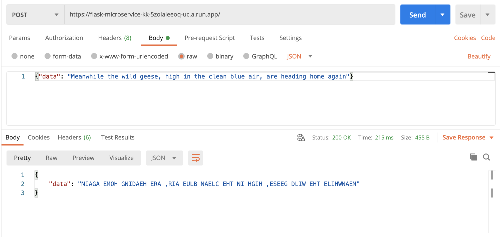

# Kayla's Flask Microservice

## Overview 

This is an example Flask microservice deployed to Google Cloud Platform as a Cloud Run app. 

It has one endpoint which accepts an HTTP `POST` request. A user of the app can send in a string, and the app will return the string reversed and capitalized. The

The app automatically deploys to Google Cloud Run on merge to the `main` branch.

## Getting Started - User

> If you're looking for the developer documentation, skip down to ["Getting Started - Developer"](#Getting-Started-Developer).

### Request

To use the app, create an HTTP `POST` request to `https://flask-microservice-kk-5zoiaieeoq-uc.a.run.app/`.

Set the `Content-Type` header to `application/json`. 

The request body contains one property, `data`, which should be set to the string you wish to have shouted back at you in reverse.

Here are some examples of how to make a request:

**cURL**:

```bash
curl -X POST 'https://flask-microservice-kk-5zoiaieeoq-uc.a.run.app/' \
--header 'Content-Type: application/json' \
-d '{"data": "Meanwhile the wild geese, high in the clean blue air, are heading home again"}'
```

**Python**: 

```python
import requests

url = "https://flask-microservice-kk-5zoiaieeoq-uc.a.run.app/"

payload="{\"data\": \"Meanwhile the wild geese, high in the clean blue air, are heading home again.\"}"
headers = {
  'Content-Type': 'application/json'
}

response = requests.request("POST", url, headers=headers, data=payload)

print(response.text)

```

**Node**:

```js
var request = require('request');
var options = {
  'method': 'POST',
  'url': 'https://flask-microservice-kk-5zoiaieeoq-uc.a.run.app/',
  'headers': {
    'Content-Type': 'application/json'
  },
  body: JSON.stringify({"data":"Meanwhile the wild geese, high in the clean blue air, are heading home again."})

};
request(options, function (error, response) {
  if (error) throw new Error(error);
  console.log(response.body);
});
```

**Postman**:



### Response

**200 OK**

A successful response will have a status code of 200. 

It will return a JSON response body containing the reversed, capitalized string:

```json
{
    "data": "NIAGA EMOH GNIDAEH ERA ,RIA EULB NAELC EHT NI HGIH ,ESEEG DLIW EHT ELIHWNAEM"
}
```

An unsuccessful response will have a status code of 400 or 500, depending on the error.

**400 BAD REQUEST**

If you pass in a bad request body, you will get a response like this:

```json
{
    "error": "Request body must contain 'data' parameter set to a string with a length greater than 0."
}
```

As you can see above, the response should include steps to fix the problem.


**500 INTERNAL SERVER ERROR**

If an unexpected error occurs, you will get a response like this:

```json
{
    "error": "Something broke, here's a hint: name 'foo' is not defined"
}
```

As you can see above, the response will include a hint as to what is causing the error.


## Getting Started - Developer

> If you're looking for the user documentation, skip down to ["Getting Started - User"](#Getting-Started-User).


### Installing the project

Clone the repo, create and activate a virtual environment, and install dependencies.

```bash
git clone https://github.com/kaylakantola/flask-microservice-kk.git
cd flask-microservice-kk
python3 -m venv venv
. venv/bin/activate
pip install -r requirements.txt
```

### Set exports

```sh
export FLASK_APP=app.py       
export FLASK_ENV=development
export FLASK_DEBUG=1
```

### Run the app 

```bash 
flask run
```

The terminal output should include the host your app is running on, e.g., `Running on http://127.0.0.1:5000/ `.


## Deployment 

This repo is set up with automated CI/CD.

To deploy your changes to the cloud, there are two options:

1. Push directly to the `main` branch (risky!)
2. Set up a pull request into `main`, and include `/gcbrun` in the merge request description.

### How does it work? 

In the cloud environment, there is a [Build Trigger](https://cloud.google.com/build/docs/automating-builds/create-manage-triggers) connected to the GitHub repository.

It's listening for pull requests to the `main` branch. On successful merge a build is executed.

TO BE COMPLETED: 

In an ideal future state, I would like to terraform the build trigger (rather than create thru the GUI). 

## Testing 

TO BE COMPLETED

1. Unit test
2. Integration test
3. Deploy test

## Authentication and Authorization

TO BE COMPLETED
